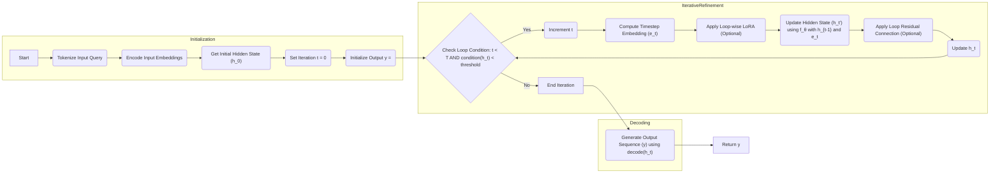

# Stable Latent Reasoning: LLM Inference Scaling

> **Enhancing Inference in Large Language Models through Iterative Latent Space Refinement**

**1. Introduction**

Large Language Models (LLMs) have demonstrated remarkable capabilities in various natural language processing tasks. However, their reasoning abilities, particularly on complex problems requiring multi-step inference, remain limited. This limitation often stems from the inherent sequential nature of text generation, where each token is predicted based on the preceding context. While techniques like Chain-of-Thought (CoT) prompting have shown improvements, they are constrained by the discrete and often inefficient nature of language for representing complex reasoning processes.

This document proposes **Stable Latent Reasoning (SLR)**, a novel framework that enables LLMs to perform iterative reasoning within a continuous latent space, enhancing their inference capabilities without increasing parameter count. SLR leverages the model's internal representations (hidden states) as "continuous thoughts" that are iteratively refined through a stabilized feedback loop.

**2. Motivation**

Current approaches to improve reasoning in LLMs often involve:

*   **Increased Model Scale:** Larger models generally perform better but are computationally expensive.
*   **Chain-of-Thought (CoT) Prompting:** Encourages step-by-step reasoning in natural language, but suffers from verbosity, potential error propagation, and the limitations of discrete tokens for representing complex reasoning steps.
*   **Test-Time Computation:** Techniques like Best-of-N sampling or using verifiers can improve results but often rely on parallel computations or external signals.

These approaches have limitations in terms of efficiency, scalability, and the ability to perform nuanced, iterative reasoning. SLR aims to address these limitations by:

*   **Leveraging Latent Space:** Performing reasoning within the model's continuous latent space, which offers a richer and more flexible representation than discrete tokens.
*   **Iterative Refinement:** Enabling the model to iteratively refine its internal "thoughts" through a feedback loop, allowing for more complex reasoning processes.
*   **Stabilization Techniques:** Introducing mechanisms to ensure the stability and convergence of the iterative refinement process.

**3. Stable Latent Reasoning Framework**

The core idea of SLR is to treat the LLM's hidden states as "continuous thoughts" that can be iteratively refined to improve reasoning. This is achieved by feeding the last hidden state (or a processed version of it) from one iteration back as the input embedding for the next.

**3.1. Iterative Refinement Process:**

Given an input query  `x`, the SLR process can be described as follows:

1. **Initialization:** The input query `x` is encoded into an initial hidden state `h_0` using the LLM's embedding layer.
2. **Iteration:** For `t = 1` to `T` (where `T` is the maximum number of iterations):
    *   `h_t = f_θ(h_{t-1})`
    *   Where:
        *   `h_t` is the hidden state at iteration `t`.
        *   `f_θ` represents the LLM with parameters `θ`, potentially modified by loop-specific LoRA modules (see Section 3.2).
3. **Output:** The final hidden state `h_T` is used to generate the output sequence `y` (e.g., the answer to the query).
    * The output can be generated using a simple linear projection or a separate trained decoder network
4. **Termination:** The model will terminate the loop when the hidden state reach a certain threshold or condition. In the simplest case, we can fixed the number of loop to a certain amount to simplify the process.

**3.2. Stabilization Techniques:**

Naively feeding `h_t` back as input can lead to instability, error accumulation, and oscillation. To mitigate these issues, we propose the following stabilization techniques:

*   **3.2.1. Timestep Embedding:**
    *   Inspired by diffusion models, we introduce a timestep embedding `e_t` that encodes the current iteration number `t`.
    *   This embedding is concatenated or added to the hidden state `h_t` before being fed into the next iteration.
    *   Optionally, `e_t` can also encode an estimated "noise level" in the latent representation, providing further guidance to the model.

*   **3.2.2. Loop-wise LoRA:**
    *   For each iteration `t`, we introduce a separate Low-Rank Adaptation (LoRA) module `L_t`.
    *   These modules are applied to the LLM's parameters `θ` during each iteration, allowing for fine-grained adjustments to the model's behavior at each step.
    *   `f_θ` becomes `f_{θ + L_t}` at each time step t.

*   **3.2.3. Loop Residual Connection:**
    *   Inspired by ResNets, we add a residual connection that combines the output of each iteration `h_t` with the initial hidden state `h_0` (or the output of the previous iteration `h_{t-1}`).
    *   This can be implemented as a simple addition: `h_t = f_θ(h_{t-1}) + h_0` or using a more complex combination mechanism.

**4. Training Procedure**

Training an SLR model can be approached in several ways:

*   **End-to-End Training:** Jointly training the base LLM parameters `θ`, the LoRA modules `L_t`, and any other components (e.g., timestep embedding network) from scratch. This approach is computationally expensive but may yield the best performance.
*   **Fine-tuning:** Start with a pretrained LLM and fine-tune the LoRA modules and potentially the timestep embedding network. This is more efficient and allows leveraging existing pre-trained models.
*   **Distillation from CoT:** Utilize existing CoT data to guide the training process. For example, the intermediate hidden states during CoT generation can be used as targets for the "continuous thoughts" in SLR. This is the approach used in the related work COCONUT, and we can extend it by using a multi-stage training, similar to iCOT paper.

**5. Evaluation and Analysis**

The effectiveness of SLR will be evaluated on a variety of reasoning tasks, including:

*   **Mathematical Reasoning:** GSM8k, MATH
*   **Logical Reasoning:** ProntoQA, Proof with Search Question-Answering (ProsQA), and other synthetic datasets that require multi-step inference.

**Key Metrics:**

*   **Accuracy:** The primary metric for evaluating the model's reasoning performance.
*   **Efficiency:** Measured by the number of forward passes (iterations) required for inference compared to standard CoT.
*   **Stability:** Assessing the convergence and stability of the iterative refinement process.
*   **Interpretability:** Analyzing the "continuous thoughts" to gain insights into the model's reasoning process. For example, by using probing classifier or by decoding it into text.

**6. Research Questions and Future Directions**

This proposal outlines the following key research questions:

*   **RQ1:** What is the optimal combination of stabilization techniques for different tasks and model architectures?
*   **RQ2:** How does the performance of SLR scale with the number of iterations `T` and the capacity of the LoRA modules?
*   **RQ3:** Can we develop effective decoding strategies to extract meaningful information from the "continuous thoughts"?
*   **RQ4:** How does SLR compare to other test-time computation methods, such as beam search and different variants of CoT?
*   **RQ5:** Can we distill the knowledge from an SLR model into a smaller, more efficient model?
*   **RQ6:** How can we adapt and optimize the training procedure for SLR, particularly in the context of limited labeled data?
*   **RQ7:** Can we pre-train LLM with SLR to be generally better at reasoning task?

**7. Expected Outcomes**

We expect that SLR will lead to:

*   **Improved Reasoning Performance:** LLMs equipped with SLR should outperform standard models on complex reasoning tasks.
*   **Enhanced Efficiency:** SLR should achieve these improvements with fewer parameters and potentially lower inference latency compared to traditional CoT methods.
*   **Novel Insights:** Analyzing the "continuous thoughts" should provide valuable insights into the model's internal reasoning process.
*   **New Research Directions:** SLR opens up new avenues for research in areas such as latent space manipulation, iterative refinement, and the development of more efficient and interpretable reasoning systems.

**8. Conclusion**

Stable Latent Reasoning offers a promising new approach to enhance the reasoning capabilities of LLMs by enabling iterative refinement within a continuous latent space. The proposed stabilization techniques, inspired by diffusion models, relaxed recursive transformers, and ResNets, address the key challenges of this approach. We believe that SLR has the potential to significantly advance the field of AI and contribute to the development of more powerful and efficient reasoning systems. This research will pave the way for more sophisticated AI agents capable of tackling complex, open-ended problems that require nuanced understanding and multi-step inference.

**9. Relation to Cited Papers**

Our idea builds upon and extends the concepts presented in the cited papers:
- [Relaxed Recursive Transformer](https://arxiv.org/abs/2410.20672): We borrow the idea of loop-specific parameter adjustments (LoRA) to add flexibility to each iteration.
- [Diffusion Models](https://arxiv.org/abs/2112.10752): We adopt the concept of timestep embeddings to guide the iterative refinement process.
- [ResNets](https://arxiv.org/abs/1512.03385): We incorporate residual connections to stabilize the loop and prevent error accumulation.
- [COCONUT](https://arxiv.org/abs/2412.06769v1): This is the most closely related, and we build upon it by adding the stabilization techniques. Our method offers a more general and potentially more powerful approach to latent reasoning.